# OmniSight 👁️✨

> **Autonomous Multimodal Visual Regression Testing & Self-Healing Engine**  
> Powered by **Gemini 2.5 Flash**, **Groq LLaMA 3.1**, **Playwright**, and **LangGraph**.

---

## 🚀 Overview

**OmniSight** is an AI-native quality assurance platform that automates the detection, root-cause diagnosis, code patching, and GitHub Pull Request creation for visual frontend regressions across responsive viewports (**Mobile 375px**, **Tablet 768px**, **Desktop 1440px**).

```mermaid
flowchart LR
    CI[CI/CD Webhook / Commit] --> ML[FastAPI Webhook Gateway]
    ML --> NAV[Playwright Multi-Viewport Navigator]
    NAV --> VLM[Gemini 2.5 Flash Vision Audit]
    VLM --> EXTRACT[Fix Extraction Engine]
    EXTRACT --> GRAPH[LangGraph Self-Healing Loop]
    GRAPH --> GROQ[Groq LLaMA 3.1 Summarizer]
    GROQ --> GH[Automated GitHub PR]
    GH --> DASH[QA Review Dashboard]
```



---

## 🏗️ Monorepo Services

| Service | Technology Stack | Port | Description |
| :--- | :--- | :--- | :--- |
| **`backend/`** | Node.js, Express, Mongoose, JWT | `5000` | Core API for auth, build runs, fix attempts, and PR decision management |
| **`ml-service/`** | Python 3.11, FastAPI, Playwright, LangGraph, Google GenAI, Groq | `8000` | Autonomous visual auditor, VLM analysis engine, and self-healing loop |
| **`frontend/`** | React 18, Vite, Tailwind CSS, Radix UI, TanStack Query | `5174` | QA review dashboard with side-by-side screenshot diffs and PR controls |
| **`test-target-app/`** | React 18, Vite, Tailwind CSS ("TinyCart") | `5173` | E-commerce application under test |
| **`scripts/`** | Python, Shell | — | Automation utilities and end-to-end smoke test runners |

---

## 🛠️ Prerequisites

- **Node.js** v20+ & **npm**
- **Python** 3.11+
- **Docker Desktop** (optional for multi-container orchestration)
- **API Keys**:
  - Google Gemini API Key (`aistudio.google.com/apikey`)
  - Groq API Key (`console.groq.com`)
  - GitHub Fine-grained PAT (scoped to repository contents & pull requests)
  - MongoDB Atlas Connection String (or local MongoDB)

---

## ⚙️ Environment Configuration

Copy `.env.example` to `.env` in each service directory and populate your credentials:

### 1. `backend/.env`
```env
PORT=5000
MONGO_URI=mongodb://localhost:27017/omnisight
JWT_SECRET=your_jwt_secret_64_bytes
INTERNAL_API_KEY=your_internal_api_key_32_bytes
```

### 2. `ml-service/.env`
```env
GEMINI_API_KEY=your_gemini_api_key
GROQ_API_KEY=your_groq_api_key
GITHUB_TOKEN=your_github_pat_token
GITHUB_REPO=your_username/tinycart
INTERNAL_API_KEY=your_internal_api_key_32_bytes
REDIS_URL=redis://localhost:6379/0
BACKEND_URL=http://localhost:5000
TEST_TARGET_APP_URL=http://localhost:5173
```

### 3. `frontend/.env`
```env
VITE_BACKEND_URL=http://localhost:5000
```

### 4. `test-target-app/.env`
```env
VITE_PORT=5173
```

---

## 🏃 Running Locally

### Option A: Running Full Stack with Docker Compose
```bash
docker-compose up --build
```

### Option B: Running Individual Services

#### 1. Backend (`backend/`)
```bash
cd backend
npm install
npm run dev
# Health check: http://localhost:5000/health
```

#### 2. ML Service (`ml-service/`)
```bash
cd ml-service
pip install -r requirements.txt
playwright install chromium
uvicorn main:app --reload --port 8000
# Health check: http://localhost:8000/health
```

#### 3. Test Target App (`test-target-app/`)
```bash
cd test-target-app
npm install
npm run dev
# App URL: http://localhost:5173
```

#### 4. QA Dashboard (`frontend/`)
```bash
cd frontend
npm install
npm run dev
# Dashboard URL: http://localhost:5174
```

---

## 🧪 Testing & Verification

Run automated test suites for each service:

```bash
# Backend Test Suite (Auth + Build Runs + Internal API)
cd backend && npm test

# ML Service Test Suite (VLM Analyzer + Groq Helper + Webhook + Fix Extractor)
cd ml-service && pytest tests/ -v
```

---

## 📋 Implementation Roadmap

- [x] **Phase 0: Monorepo Scaffolding & TinyCart UI**
  - [x] Monorepo structure, Docker Compose, environment configs
  - [x] Complete "TinyCart" e-commerce application UI with Tailwind & React Router
- [x] **Phase 1: Authentication, Playwright Navigation & Webhook Gateway**
  - [x] Node/Express JWT authentication and role-based access control (`qa_manager`)
  - [x] Mongoose models for `BuildRun`, `FixAttempt`, `PullRequestRecord`
  - [x] Multi-viewport Playwright checkout navigator (375px, 768px, 1440px)
  - [x] FastAPI webhook intake gateway & async background task dispatcher
- [x] **Phase 2: Multimodal Prompting, Groq Summarizer & Fix Extraction**
  - [x] Gemini 2.5 Flash multimodal vision analysis engine (`analyze.py`)
  - [x] Groq LLaMA 3.1 PR summarizer & commit message generator (`groq_helper.py`)
  - [x] CodeFix extraction & Tailwind normalization engine (`extract_fix.py`)
  - [x] Mid-Project Review Vision Audit test suite
- [ ] **Phase 3: LangGraph Self-Healing Loop & GitHub PR Automation**
  - [ ] LangGraph state graph autonomous loop (`graph.py`)
  - [ ] Automated GitHub fix branch & PR creation (`github_integration.py`)
- [ ] **Phase 4: Image Crop Optimization, QA Dashboard & Deployment**
  - [ ] Region cropping token optimization (`crop_utils.py`)
  - [ ] Interactive React QA review dashboard with side-by-side diffs
  - [ ] Full stack Docker containerization & CI/CD action triggers
